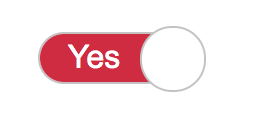

# Fun with CSS - Holberton School

Welcome to the **Fun with CSS** project repository! This project is part of the **Holberton School Full-Stack** curriculum, focusing on experimenting with creative layouts and animations using only HTML and CSS—without JavaScript.

---

## Table of Contents

- [Description](#description)
- [Project Structure](#project-structure)
- [Learning Objectives](#learning-objectives)

---

## Description

This project explores the capabilities of **pure CSS** to create dynamic and interactive web elements. Through a series of challenges, different CSS techniques such as **sprites, animations, transitions, and custom toggles** are implemented to enhance front-end development skills.

Each task requires solving a **design problem** using only **HTML and CSS**, without JavaScript. The project demonstrates various creative UI components, including **sprite-based icons, animated underlines, custom toggles, and interactive navigation menus**.

---

## Project Structure

The repository contains the following stylesheets, each implementing a unique CSS feature:

| File           | Description                                                                                                     |
| -------------- | :-------------------------------------------------------------------------------------------------------------- |
| `0-styles.css` | Implements a **sprite-based** icon system using a single image (`0-sprite.png`) and CSS background positioning. |
| `1-styles.css` | Creates an **animated underline effect** for hyperlinks, appearing gradually on hover.                          |
| `2-styles.css` | Styles a **custom toggle switch**, replacing the default checkbox appearance with an interactive switch design. |
| `3-styles.css` | Implements a **hamburger menu animation**, where menu items smoothly slide in and out from the toggle button.   |

---

## Learning Objectives

By the end of this project, the following concepts should be mastered:

- Implement **sprite-based** icons using CSS background positioning.
- Use **CSS transitions** to create smooth visual effects.
- Design **custom UI components** such as toggles and menus purely with HTML and CSS.
- Apply **CSS animations** to enhance interactivity and user experience.
- Develop an understanding of **checkbox hacks** for interactive elements without JavaScript.

Mastering these CSS techniques enables the creation of highly interactive web elements, pushing the boundaries of what is possible using **pure HTML and CSS**.

---

## Screenshots

### `0-styles.css`

### `1-styles.css`

line.gif)

### `2-styles.css`

 

### `3-styles.css`

---
